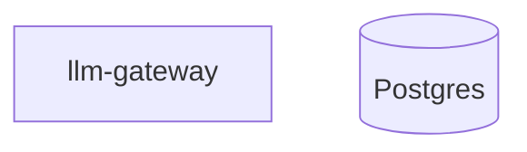

# Kai Visualizations Plugin

AI-driven diagram & chart authoring for Kai Desktop. Describe what you want in natural language; the agent generates and edits Mermaid or Chart.js source, rendered live in a pan/zoom canvas with full revision history.

## Features

- **Per-project chat thread** — each visualization has its own conversation with the agent
- **Two engines** — [Mermaid](https://mermaid.js.org/) for ERDs, flowcharts, sequence, class, state, C4, gantt; [Chart.js](https://www.chartjs.org/) for bar/line/pie/scatter data charts
- **Editable source** — toggle to raw source, hand-edit, save as a revision
- **Branching revision history** — every AI or manual change is a node in a revision tree. Undo/redo move a `HEAD` pointer; editing after undo forks a new branch. Check out any node on any branch from the History tab.
- **Duplicate** — clone a project (source + chat + full revision tree) from the sidebar or toolbar
- **Deep links** — click a node in one diagram to jump into another project; breadcrumbs to navigate back
- **Export** — SVG, PNG, or raw source
- **AI tools** — Kai's main assistant can list, search, create, read, update, and delete visualizations from any conversation

## Deep linking

Bind a specific node to another project by adding a Mermaid `click` directive:



For Chart.js, add a top-level `_links` map keyed by `"<datasetIndex>.<pointIndex>"` with a `viz://` value:

```json
{
  "type": "bar",
  "data": { ... },
  "_links": { "0.2": "viz://<project-id>#<optional-node>" }
}
```

The agent knows about your other projects and will emit the correct `viz://` id when you ask it to "link the gateway box to the networking diagram."

## Install

**From marketplace / release tarball** — recommended. Kai extracts the tarball to `~/.kai/plugins/visualizations/`.

**From source:**

```bash
git clone <repo-url> kai-plugin-visualizations
cd kai-plugin-visualizations
npm install
npm run dev   # writes backend.js/frontend.js/plugin.json to ~/.kai/plugins/visualizations/
```

`npm run build` writes to `./dist/` (for packaging), not to the Kai plugins dir.

## Development

```bash
npm install
npm run dev   # watches src/, writes to ~/.kai/plugins/visualizations/
```

Restart Kai Desktop (or reload plugins) to pick up backend changes; frontend hot-reloads on state republish.

## Release

Trigger the **Release Plugin** workflow in GitHub Actions with a version bump. It builds `dist/`, tags, and attaches `visualizations-vX.Y.Z.tar.gz` to a GitHub release.
